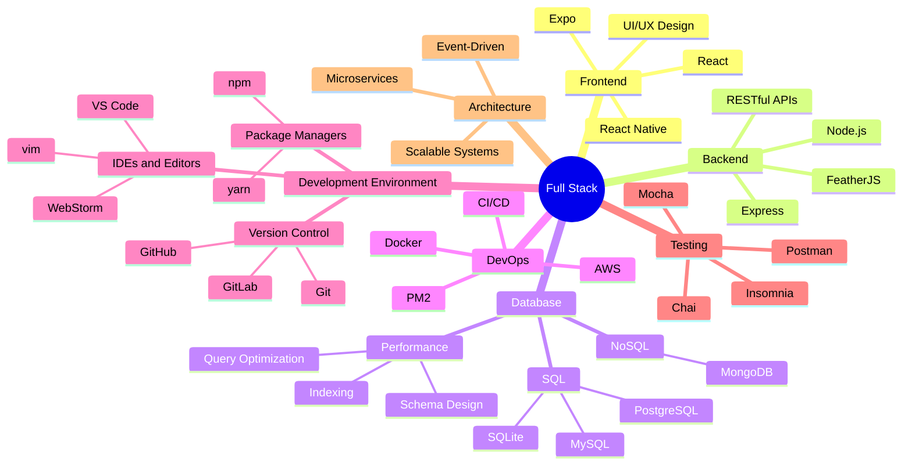

  
# Hello World! 

  

  

## 👨‍💻 About Me

- 🎓 Alumnus of **Florida Atlantic University** 🦉
- 🔭 Building scalable **CRUD applications** and **interactive dashboards**
- 🚀 Passionate about creating seamless user experiences
- 🏀 Former professional basketball player
- ⚽ Sports enthusiast
- 

## 🛠️ Technology Arsenal

| Domain | Technologies |
|--------|-------------|
| **Frontend & Mobile** |    |
| **Backend & APIs** |    |
| **Database Systems** |     |
| **Cloud & DevOps** |    |
| **Development Tools** |    |
| **Testing & API Tools** |     |

## 💡 Technical Expertise

