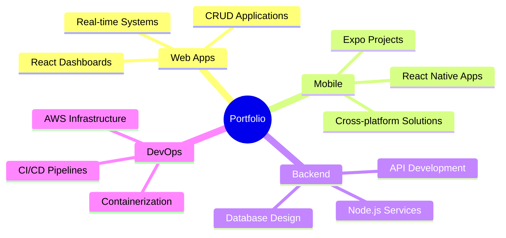

  
# Hello World! 👋

  

  

## 👨‍💻 About Me

- 🎓 Alumnus of **Florida Atlantic University** 🦉
- 🔭 Building scalable **CRUD applications** and **interactive dashboards**
- 🚀 Passionate about creating seamless user experiences
- 🏀 Former professional basketball player turned tech enthusiast
- ⚽ Sports enthusiast who brings the same competitive spirit to coding

## 🛠️ Technology Stack

| Domain | Technologies |
|--------|-------------|
| **Frontend & Mobile** |    |
| **Backend & APIs** |    |
| **Database Systems** |   |
| **Cloud & DevOps** |   |

## 🎯 Key Projects

## 📫 Get in Touch
- 
- 
- 
