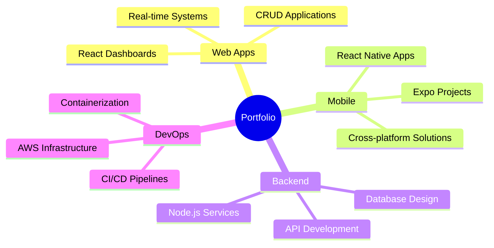

  
# Hi 👋, I'm Esad

  

  
  
  

## 👨‍💻 About Me

- 🎓 **Alumnus** of Florida Atlantic University 🦉  
- 🛠️ Building scalable **CRUD applications** and **interactive dashboards**  
- 🚀 Passionate about crafting **seamless user experiences**  
- 🏀 Former professional basketball player turned tech enthusiast  
- ⚽ Sports enthusiast bringing the same competitive spirit to coding  

---

## 🛠️ Technology Stack

  
### Frontend & Mobile

---

### Backend & APIs

---

### Database Systems

---

### Cloud & DevOps

---

### Tools & Frameworks

---

## 🎯 Key Projects

---

<!-- Contribution Stats -->

